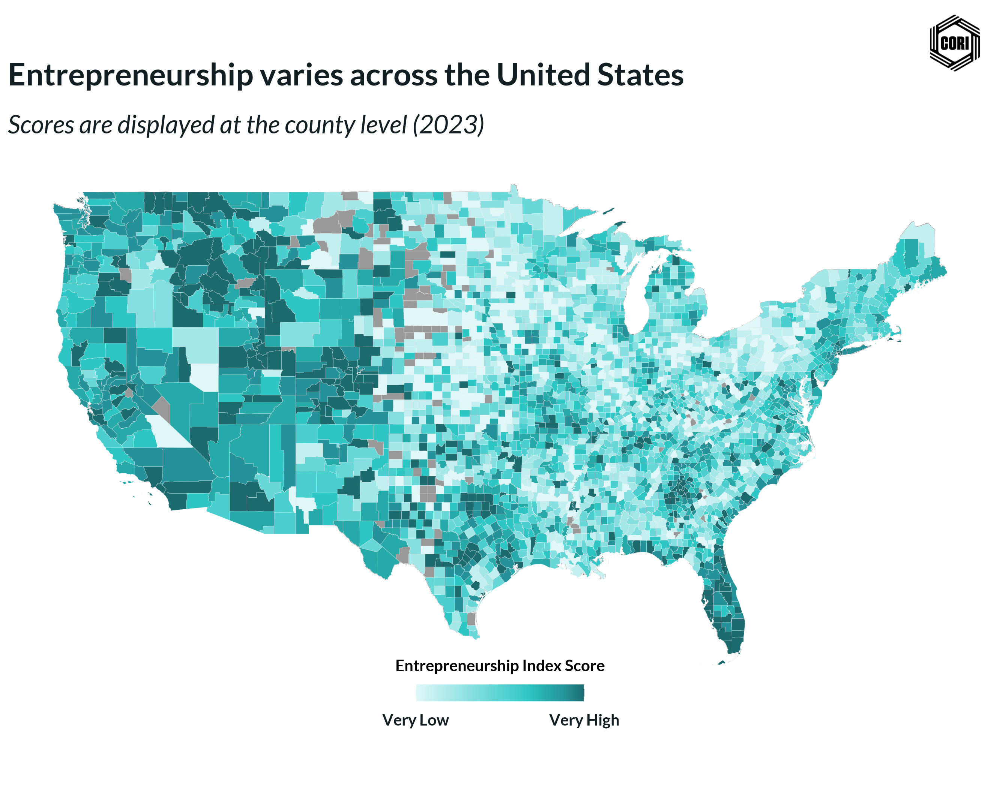

## Overview

This choropleth map displays the decile classification of the robust kernel PCA global entrepreneurship index across all U.S. counties for 2023. Counties are shaded from lightest (decile 1 — lowest entrepreneurship activity) to darkest (decile 10 — highest activity). The decile map provides finer geographic resolution than septile classification and is used alongside the septile map to assess sensitivity of spatial patterns to classification granularity.

## Key Findings

- Rural counties in the Mountain West and Great Plains show elevated index scores relative to their population size, suggesting entrepreneurship rates that outpace firm counts alone.
- High-decile clusters in metro-adjacent rural counties indicate spillover entrepreneurship dynamics.
- Decile and septile maps are compared side-by-side in the project analysis to confirm that key geographic patterns are classification-method invariant.

## Reproducibility

Generated by `R/analysis/global_eship_index_revised.Rmd` in the Capital One Business Demographics Analysis project.
