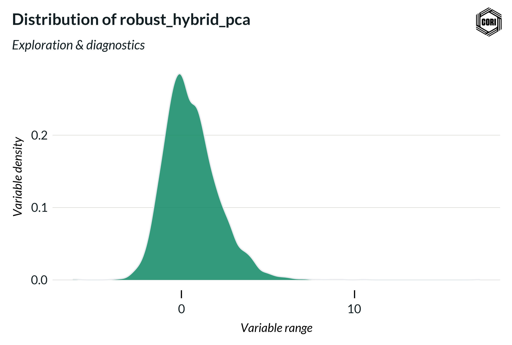

## Overview

This density plot displays the distribution of the robust hybrid kernel PCA entrepreneurship index across all U.S. counties for the 2023 vintage. The index is constructed from ACS-derived variables (business entry rates, self-employment rates, proprietor income shares) and BDS establishment entry/exit rates using kernel Principal Component Analysis. The distribution reflects the spread and central tendency of entrepreneurship activity as measured by the composite index, prior to septile or decile classification.

## Key Findings

- The distribution provides a diagnostic view of index spread before classification into septiles or deciles.
- Deviation from normality in the density shape can indicate dominant drivers among the PCA input variables.
- Robust kernel methods are used to reduce sensitivity to outlier counties in high-activity metro areas.

## Reproducibility

Generated by `R/utils/pca_output_utils.R` in the Capital One Business Demographics Analysis project.
