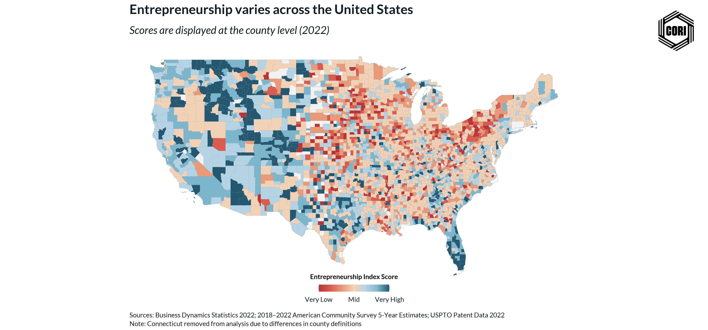

## Overview

This choropleth map displays the septile classification of the global entrepreneurship index across all U.S. counties using the latest available data vintage. The global index applies a single kernel PCA model to all counties regardless of rural or metro classification, producing a nationally consistent ranking from lowest (septile 1) to highest (septile 7) entrepreneurship activity. This map represents the most current version of the index and is the primary output used in client-facing deliverables.

## Key Findings

- The latest-vintage global index provides the most current picture of county-level entrepreneurship activity nationally.
- Comparison with the 2022 vintage map identifies counties with meaningful upward or downward movement in their septile rank.
- Metro and rural county patterns can be compared directly since the global index uses a single unified model across all geographies.

## Reproducibility

Generated by `R/analysis/global_eship_index_map_revised.Rmd` in the Capital One Business Demographics Analysis project.
