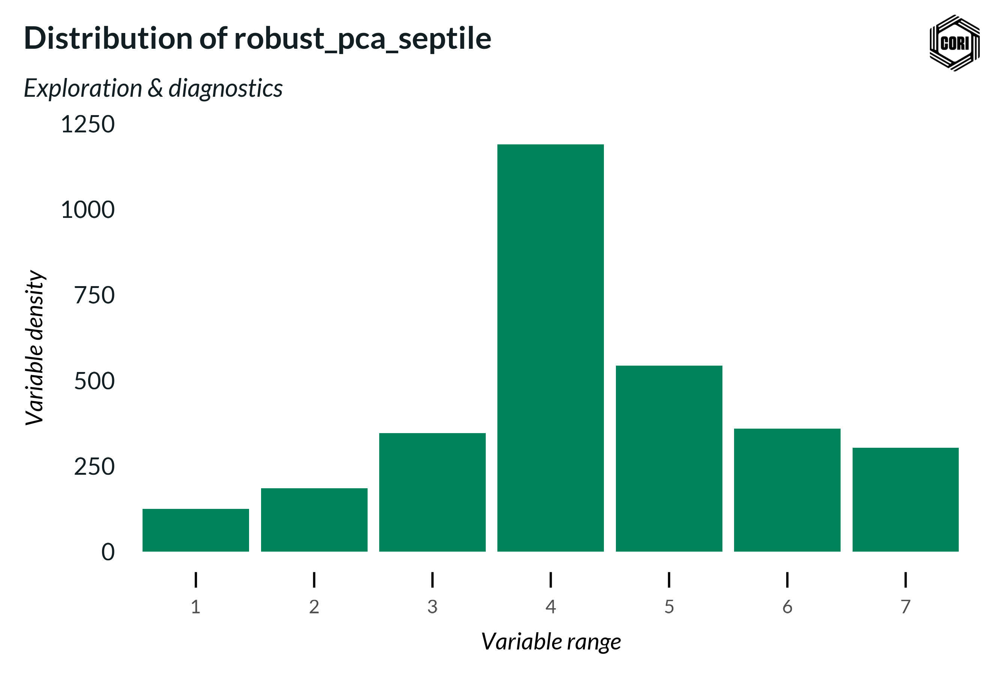

## Overview

This histogram shows the count of U.S. counties falling into each of the seven septile bins of the robust kernel PCA entrepreneurship index for 2023. Septiles divide the county distribution into seven equal-population groups ranked from lowest (1) to highest (7) entrepreneurship activity. The histogram serves as a kernel diagnostic — near-uniform bar heights indicate balanced classification across the index distribution, while skew may reveal methodological artifacts or genuine geographic concentration.

## Key Findings

- Septile classification is applied after robust kernel PCA to normalize the index across the full national county distribution.
- Histogram balance confirms that the kernel PCA output does not collapse counties into extreme values.
- Used alongside the density plot as part of the kernel diagnostic suite for index validation.

## Reproducibility

Generated by `R/analysis/kernel_diagnostics.R` in the Capital One Business Demographics Analysis project.
