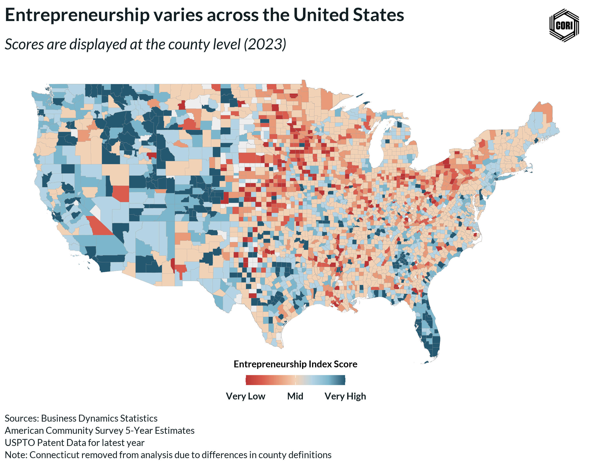

## Overview

This choropleth map displays the septile classification of the robust kernel PCA entrepreneurship index across all U.S. counties for 2023. Unlike the standard global index, this map uses a robust kernel method designed to downweight the influence of extreme outlier counties on the PCA solution, producing a more stable index in the presence of high-activity metro outliers. Counties are ranked from lowest (septile 1) to highest (septile 7) entrepreneurship activity. This map is compared directly with the standard global septile map and the decile map as part of the methodological robustness evaluation.

## Key Findings

- The robust PCA septile map is the primary comparison benchmark for validating that the standard global index is not distorted by high-leverage metro counties.
- Differences between the robust and standard septile maps identify counties whose classification is sensitive to outlier influence in the PCA solution.
- The 2023 single-year vintage is compared to a 3-year average variant to assess temporal stability of county rankings.

## Reproducibility

Generated by `R/analysis/global_eship_index_revised.Rmd` in the Capital One Business Demographics Analysis project.
