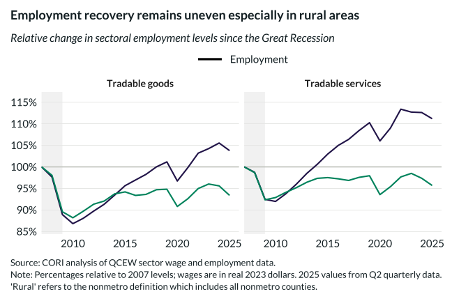

## Overview

This chart compares employment recovery across tradable goods and tradable services sectors for rural and nonrural areas since 2007.

## Key Findings

- Tradable goods employment has declined in both rural and nonrural areas
- Tradable services employment shows stronger recovery in nonrural areas
- Rural areas face structural employment challenges across both sectors

## Reproducibility

Generated by `R/viz/presentation/sector_job_changes_2A.R` in the producing project.

::: {.callout-note}
## Dangling references

The following slugs are referenced by this project but do not yet have nodes in Dataverse. They are intentionally preserved as future content needs:

- `dataset/bls-cpi-deflators`
:::

