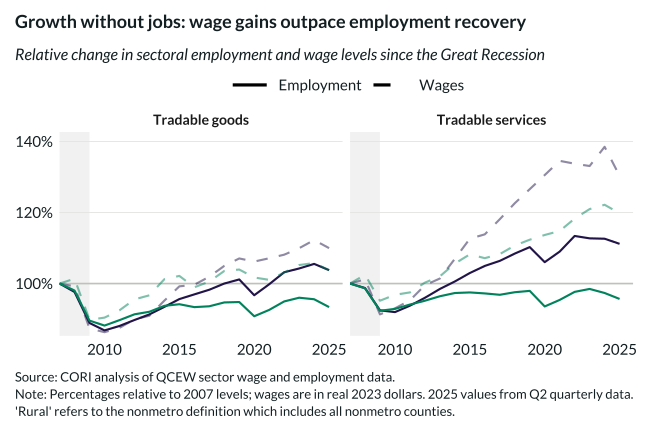

## Overview

This chart reveals the divergence between wage growth and employment recovery across sectors, highlighting that productivity gains have not translated to job creation.

## Key Findings

- Real wages have increased substantially across all sectors and rurality
- Employment recovery lags significantly behind wage growth
- The wage-employment gap is most pronounced in rural tradable goods

## Reproducibility

Generated by `R/viz/presentation/sector_job_wage_changes_2B.R` in the producing project.

::: {.callout-note}
## Dangling references

The following slugs are referenced by this project but do not yet have nodes in Dataverse. They are intentionally preserved as future content needs:

- `dataset/bls-cpi-deflators`
:::

