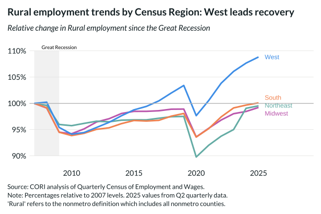

## Overview

Facets the rural employment index by Census region (Northeast, Midwest, South, West), revealing that recovery from the Great Recession varies substantially by geography.

## Key Findings

- The West leads rural employment recovery, crossing back above 2007 levels earlier than other regions.
- The Midwest and South show more moderate recoveries with persistent gaps below baseline.
- The Northeast has the weakest rural employment trajectory of the four regions.
- Regional divergence accelerated after COVID-19 as migration shifted labor supply across geographies.

## Reproducibility

Generated by `R/viz/presentation/emp_change_lc.R` in the producing project.

