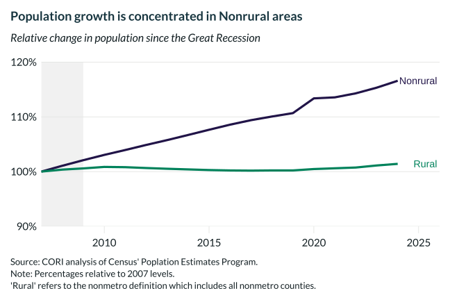

## Overview

Tracks total population change relative to 2007 for rural and nonrural counties using Census Population Estimates, showing the widening gap in population trajectories.

## Key Findings

- Nonrural population has grown steadily since 2007; rural population has been essentially flat or declining.
- The rural-nonrural population gap widened through 2019 before the pandemic-era reshuffling.
- Rural population decline is driven by natural decrease (deaths exceeding births) in many counties combined with domestic outmigration.
- Post-2020 rural population uptick partially reflects domestic in-migration but data lags complicate attribution.

## Reproducibility

Generated by `R/viz/presentation/population_lc.R` in the producing project.

