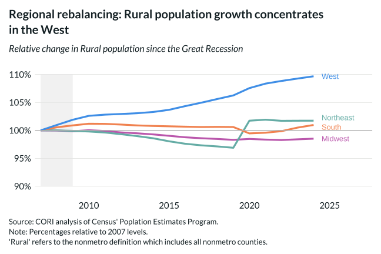

## Overview

Breaks down rural population change by Census region since 2007, revealing that the West is the only region with sustained rural population growth while the Northeast and Midwest show persistent rural population decline.

## Key Findings

- Rural West population has grown consistently since 2007, outpacing all other regions.
- Rural Northeast and Midwest counties have experienced population loss across most of the period.
- The South shows modest rural population growth, largely driven by in-migration from high-cost metros.
- Regional patterns reflect both structural economic forces and migration preferences.

## Reproducibility

Generated by `R/viz/presentation/population_rural_region_lc.R` in the producing project.

