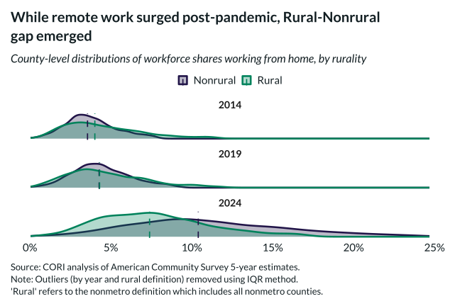

## Overview

Overlays density distributions of county-level remote work shares for rural and nonrural counties in 2018 (pre-pandemic) and 2023 (post-pandemic), using ACS 5-year estimates with outliers removed via IQR method.

## Key Findings

- Remote work shares rose dramatically from 2018 to 2023 in both rural and nonrural counties.
- Nonrural counties shifted further right, resulting in a wider rural-nonrural gap by 2023.
- The density overlap in 2018 was near-complete; by 2023, nonrural counties show a distinctly higher mode.
- Outliers removed by IQR method to focus on the typical county rather than extreme cases.

## Reproducibility

Generated by `R/viz/presentation/remote_work_density_plot.R` in the producing project.

