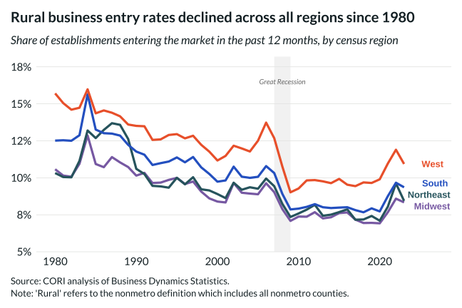

## Overview

Plots establishment entry rates for rural counties in each Census region since 1980, revealing a long-run structural decline in rural business dynamism that predates the Great Recession.

## Key Findings

- Entry rates have fallen in all four Census regions, suggesting a secular — not cyclical — trend.
- The South shows the highest rural entry rates throughout the series; the Northeast the lowest.
- Rates compressed across regions over time, narrowing regional differences in business creation.
- The post-2020 uptick across regions may reflect pandemic-era entrepreneurship but has not reversed the long-run trend.

## Reproducibility

Generated by `R/viz/presentation/biz_entry_region_lc.R` in the producing project.

