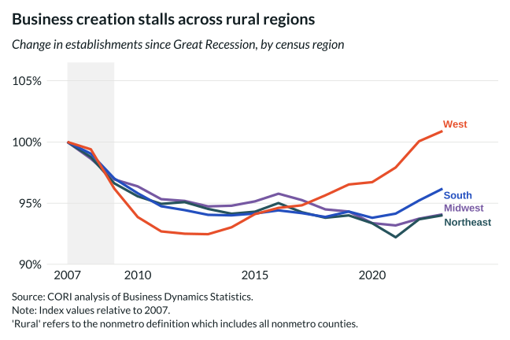

## Overview

Indexes the number of establishments in rural counties to a 2007 baseline and plots trends by Census region, revealing that rural establishment counts have recovered unevenly — and in some regions have not returned to pre-recession levels.

## Key Findings

- The South and West show the strongest rural establishment recovery since 2007.
- The Midwest and Northeast have fewer rural establishments than in 2007 as of 2023.
- Establishment growth and job creation are related but distinct: firm entry rates may rise while counts stagnate if exit rates are also high.
- Post-pandemic entrepreneurship is visible in a modest upward inflection after 2020 across regions.

## Reproducibility

Generated by `R/viz/presentation/estab_by_region_lc.R` in the producing project.

