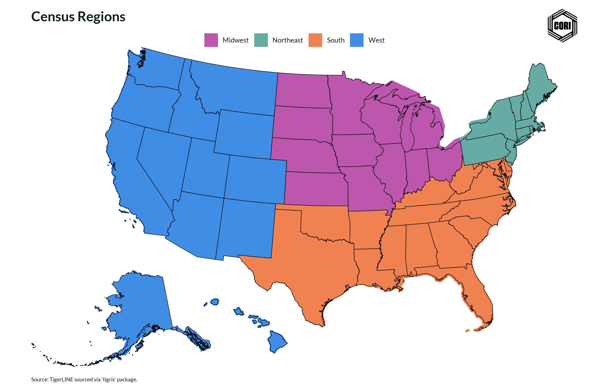

## Overview

This reference map shows the four Census Bureau regions: Northeast, Midwest, South, and West.

## Key Findings

- The U.S. is divided into four Census regions for statistical purposes
- This map provides geographic context for regional analyses in other charts

## Reproducibility

Generated by `R/viz/presentation/map_regions.R` in the producing project.

