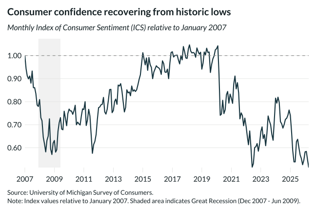

## Overview

This chart tracks the University of Michigan Index of Consumer Sentiment, a leading indicator of economic confidence and spending behavior.

## Key Findings

- Consumer sentiment hit historic lows during the Great Recession and in 2022
- Confidence is recovering but remains below pre-2007 levels
- The index shows high sensitivity to economic shocks

## Reproducibility

Generated by `R/viz/presentation/consumer_sentiment.R` in the producing project.

::: {.callout-note}
## Dangling references

The following slugs are referenced by this project but do not yet have nodes in Dataverse. They are intentionally preserved as future content needs:

- `dataset/umich-consumer-sentiment`
:::

