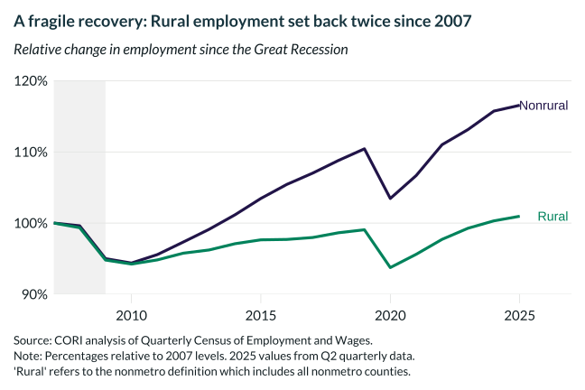

## Overview

This chart tracks employment levels in rural and nonrural counties relative to 2007 (pre-Great Recession) baseline. It reveals that rural areas experienced deeper employment losses and slower recovery compared to nonrural areas.

## Key Findings

- Rural employment has not fully recovered to pre-2007 levels
- Nonrural areas recovered and exceeded 2007 employment by approximately 15%
- The COVID-19 pandemic caused a second major setback to rural employment recovery

## Reproducibility

Generated by `R/viz/presentation/emp_change_lc.R` in the producing project.

