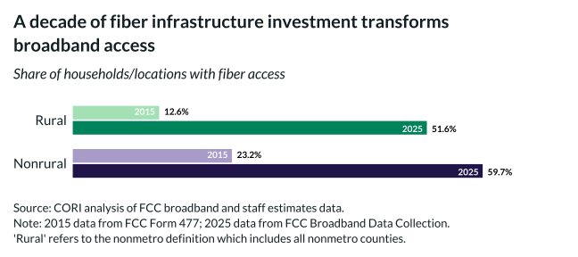

## Overview

This chart tracks the growth of fiber broadband availability over the past decade, showing significant infrastructure investment.

## Key Findings

- Fiber availability has increased dramatically over the past decade
- The rural-nonrural fiber gap has narrowed but persists
- Recent infrastructure investments are accelerating rural fiber deployment

## Reproducibility

Generated by `R/viz/presentation/fiber_share_grouped_bar.R` in the producing project.

