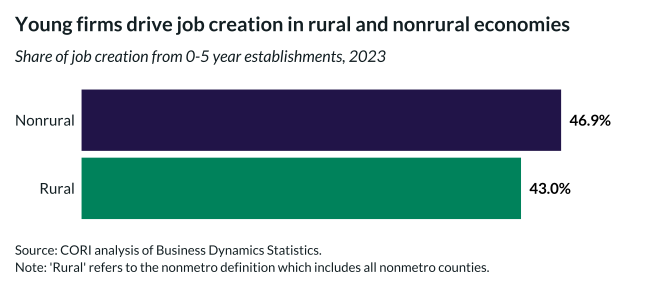

## Overview

This bar chart shows the aggregate share of job creation from young establishments in rural vs nonrural economies.

## Key Findings

- Young firms (0-5 years) create approximately 40% of all new jobs
- The share is similar in rural and nonrural areas

## Reproducibility

Generated by `R/viz/presentation/job_creation_density.R` in the producing project.

