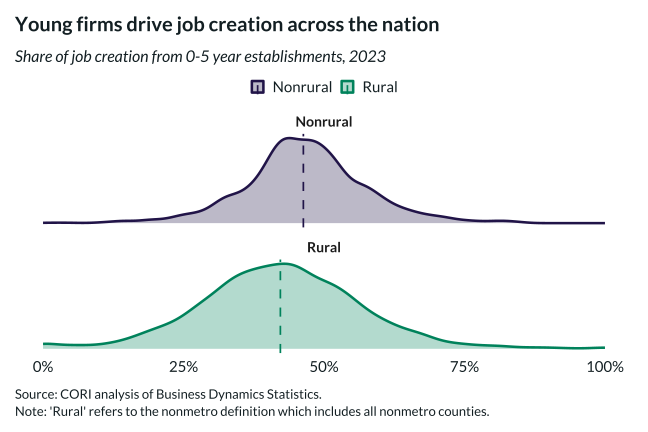

## Overview

This density plot shows the county-level distribution of job creation attributable to young firms (0-5 years old), comparing rural and nonrural areas.

## Key Findings

- Young firms account for a substantial share of job creation in both rural and nonrural areas
- The distribution of young-firm job creation is similar across rurality
- Median share of job creation from young firms is approximately 40%

## Reproducibility

Generated by `R/viz/presentation/job_creation_density.R` in the producing project.

