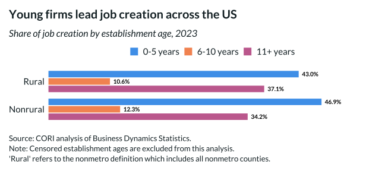

## Overview

This grouped bar chart breaks down job creation by establishment age, showing that young firms are disproportionately responsible for net job creation.

## Key Findings

- Youngest establishments (0-5 years) create the most jobs per establishment
- Job creation rates decline with firm age
- The pattern is consistent across rural and nonrural areas

## Reproducibility

Generated by `R/viz/presentation/job_creation_grouped_bar.R` in the producing project.

