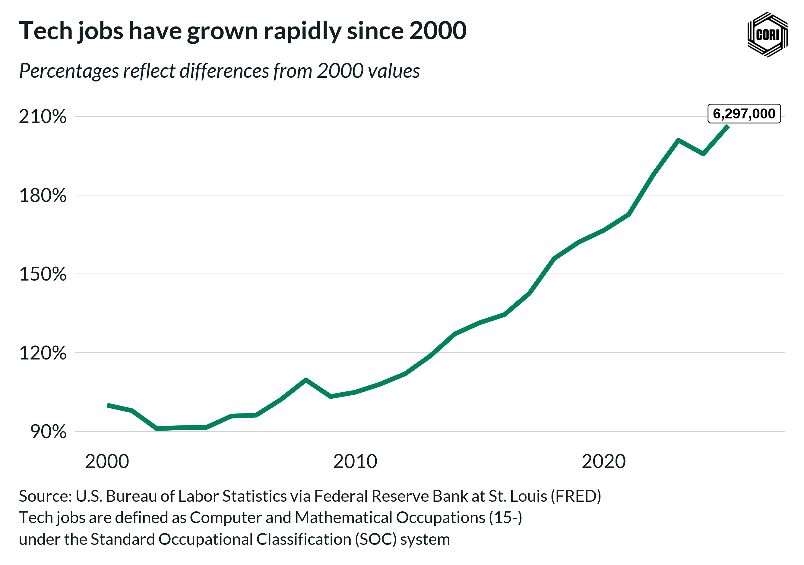

## Overview

This chart provides a longer view of tech employment since 2000, capturing the dot-com bust, recovery, and recent growth.

## Key Findings

- Tech employment has recovered from the dot-com bust
- Growth accelerated after 2010
- The sector now employs significantly more than the 2000 peak

## Reproducibility

Generated by `R/viz/presentation/create_line_chart_fred_2000_2025_tech_jobs_viz.R` in the producing project.

::: {.callout-note}
## Dangling references

The following slugs are referenced by this project but do not yet have nodes in Dataverse. They are intentionally preserved as future content needs:

- `dataset/fred-tech-employment`
:::

