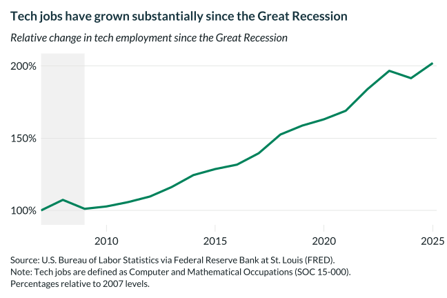

## Overview

This chart tracks tech employment growth since the Great Recession, showing strong recovery and expansion in the technology sector.

## Key Findings

- Tech employment has grown substantially since 2007
- The sector showed resilience during the Great Recession
- Tech job growth has outpaced overall employment growth

## Reproducibility

Generated by `R/viz/presentation/2007_2025_tech_jobs_viz.R` in the producing project.

::: {.callout-note}
## Dangling references

The following slugs are referenced by this project but do not yet have nodes in Dataverse. They are intentionally preserved as future content needs:

- `dataset/fred-tech-employment`
:::

