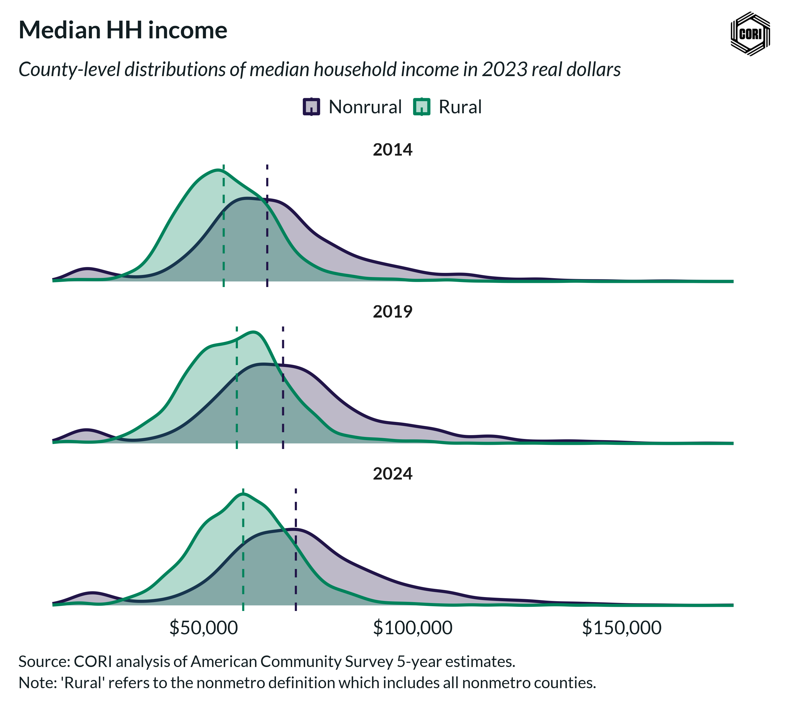

## Overview

This density plot compares the county-level distribution of median household income between rural and nonrural areas.

## Key Findings

- Nonrural counties have higher median household incomes on average
- Rural income distribution is more concentrated at lower levels
- There is significant overlap between rural and nonrural distributions

## Reproducibility

Generated by `R/viz/presentation/med_hh_income_density.R` in the producing project.

