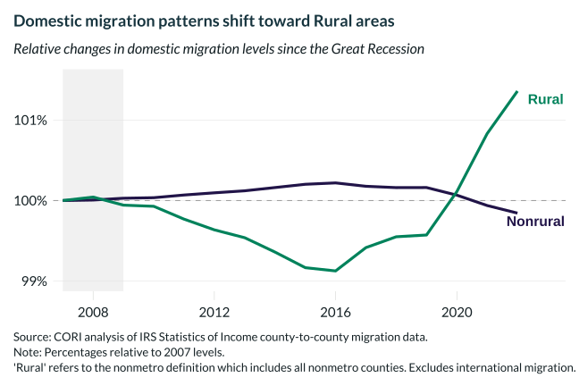

## Overview

This chart tracks domestic (non-international) migration patterns, showing a notable shift toward rural areas beginning around 2020.

## Key Findings

- Domestic migration to rural areas turned positive around 2020
- The pandemic accelerated a reversal in longstanding urban migration trends
- Rural areas are now net gainers of domestic migrants

## Reproducibility

Generated by `R/viz/presentation/net_migration_lc_domestic_only.R` in the producing project.

