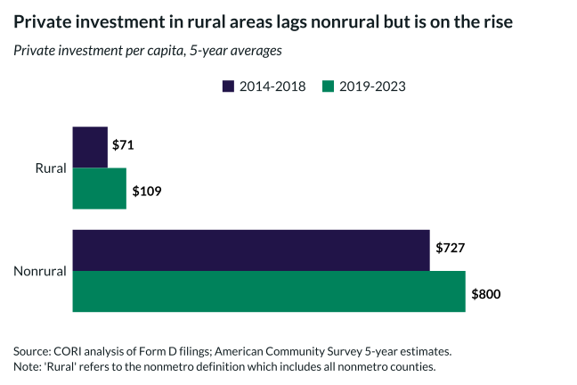

## Overview

This chart tracks private investment flows (from SEC Form D filings) on a per capita basis, comparing rural and nonrural areas.

## Key Findings

- Private investment per capita is significantly lower in rural areas
- Rural private investment has been increasing in recent years
- The rural-nonrural investment gap remains substantial

## Reproducibility

Generated by `R/viz/presentation/private_investment_per_capita.R` in the producing project.

::: {.callout-note}
## Dangling references

The following slugs are referenced by this project but do not yet have nodes in Dataverse. They are intentionally preserved as future content needs:

- `dataset/sec-form-d`
:::

