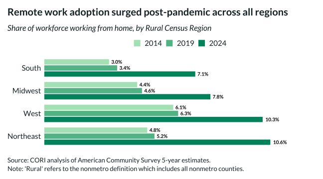

## Overview

This bar chart compares remote work rates across rural regions, showing geographic variation in remote work adoption.

## Key Findings

- Rural West has the highest remote work rates
- Rural South and Midwest have lower remote work adoption
- Regional variation reflects differences in industry mix and broadband access

## Reproducibility

Generated by `R/viz/presentation/remote_work_density_plot.R` in the producing project.

