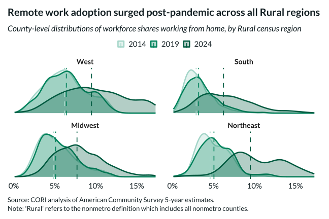

## Overview

This density plot shows the county-level distribution of remote work rates within each rural Census region.

## Key Findings

- Remote work distributions vary significantly by rural region
- Rural West counties show a wider range of remote work rates
- Rural Midwest and South have more concentrated distributions at lower rates

## Reproducibility

Generated by `R/viz/presentation/remote_work_density_plot.R` in the producing project.

