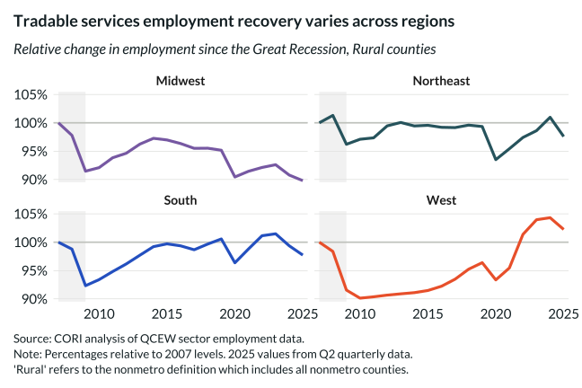

## Overview

This chart examines tradable services sector performance across Census regions, highlighting geographic variation in this key growth sector.

## Key Findings

- Tradable services employment recovery varies significantly by region
- Western and Southern regions show stronger tradable services growth

## Reproducibility

Generated by `R/viz/presentation/tradable_services_regional_job_wage.R` in the producing project.

