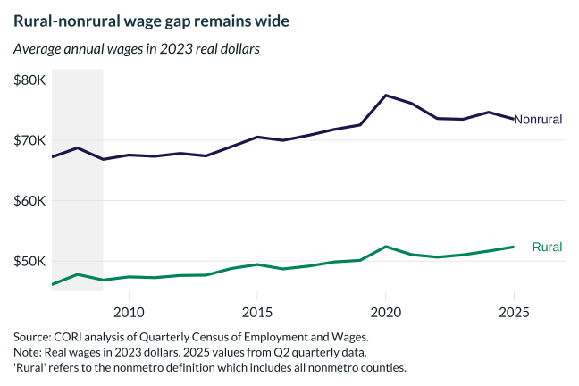

## Overview

Shows absolute real average annual wages (2023 dollars) for rural and nonrural counties from 2007 to 2024, placing the relative wage convergence in context: despite faster rural growth rates, the absolute dollar gap remains substantial.

## Key Findings

- Nonrural average annual wages remain significantly higher in absolute terms than rural wages throughout the period.
- The absolute dollar gap has widened even as the relative gap narrowed, because both series grew but from different bases.
- Real wages in both geographies rose substantially from 2019-2022 amid COVID-era labor market tightening.
- All values are deflated to 2023 dollars using the BLS CPI-U-RS.

## Reproducibility

Generated by `R/viz/presentation/wage_change_lc.R` in the producing project.

