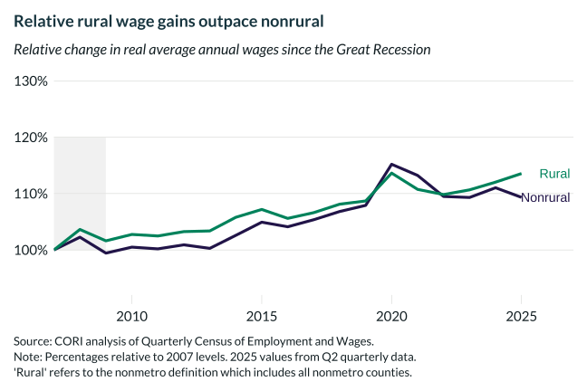

## Overview

Tracks real average annual wages (2023 dollars, BLS CPI-U-RS deflated) indexed to 2007 for rural and nonrural counties, showing that rural wage growth rates have exceeded nonrural on a relative basis.

## Key Findings

- Rural real wages grew faster in relative terms than nonrural wages since 2007.
- The relative catch-up reflects a lower rural wage base — absolute gaps in dollar terms remain wide.
- Both rural and nonrural saw real wage growth accelerate after 2020 amid tight labor markets.
- 2025 values use Q2 quarterly QCEW data and may be revised in annual releases.

## Reproducibility

Generated by `R/viz/presentation/wage_change_lc.R` in the producing project.

