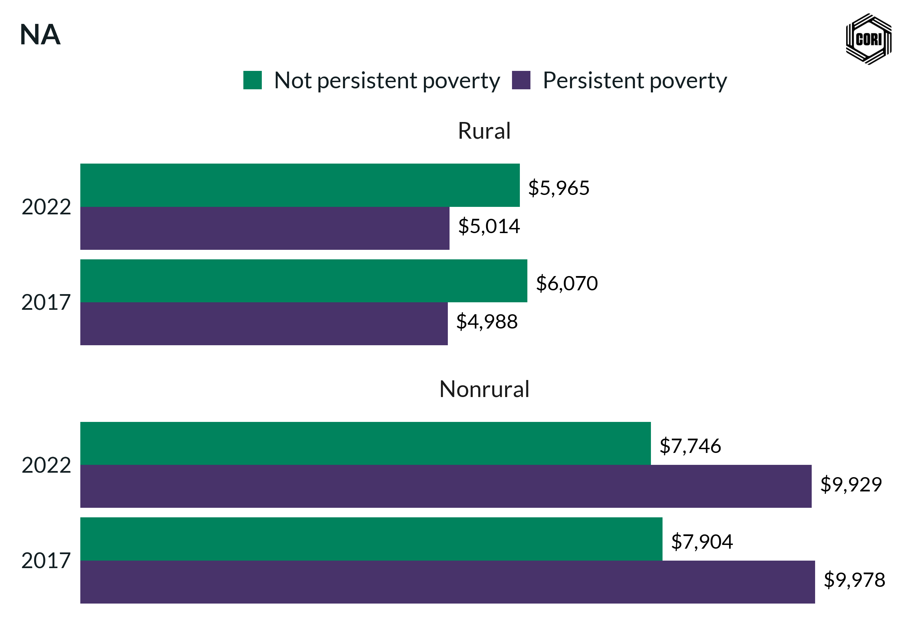

## Overview

Compares inflation-adjusted (2022 dollars) average local government direct expenditure per capita between counties classified as persistent poverty and non-persistent poverty counties, revealing structural funding disparities.

## Key Findings

- Persistent poverty counties receive less local government direct expenditure per capita than non-persistent poverty counties.
- The expenditure gap reflects the constrained local tax base in high-poverty counties, limiting capacity for self-funded public services.
- The pattern holds after inflation adjustment, indicating a structural rather than cyclical funding disparity.

## Reproducibility

Generated by `R/final_viz/L3_create_bar_chart_ppov_dir_exp_training.R` in the producing project.

::: {.callout-note}
## Dangling references

The following slugs are referenced by this project but do not yet have nodes in Dataverse. They are intentionally preserved as future content needs:

- `dataset/census-of-governments`
- `dataset/bls-cpi-deflators`
:::

