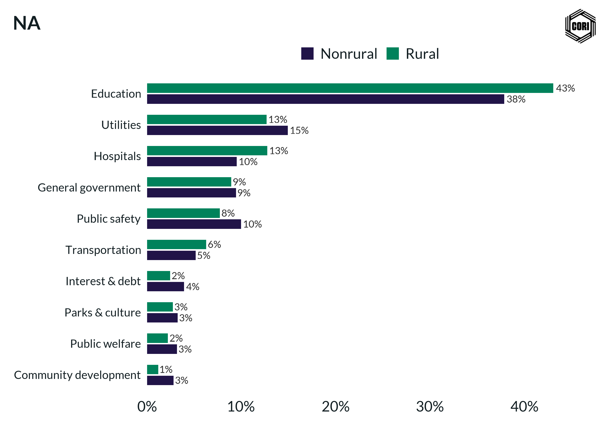

## Overview

Compares per-capita local government expenditure across multiple spending categories for rural vs. nonrural counties, highlighting where the largest rural–nonrural disparities occur.

## Key Findings

- Education is the largest expenditure category in both rural and nonrural counties.
- Nonrural counties spend substantially more per capita on public welfare, health/hospitals, and transit.
- Rural counties spend proportionally more on utilities, highways, and natural resources relative to nonrural counties.

## Reproducibility

Generated by `R/final_viz/M4_expenditures_by_rurality_bar_horz.R` in the producing project.

::: {.callout-note}
## Dangling references

The following slugs are referenced by this project but do not yet have nodes in Dataverse. They are intentionally preserved as future content needs:

- `dataset/census-of-governments`
- `dataset/bls-cpi-deflators`
:::

