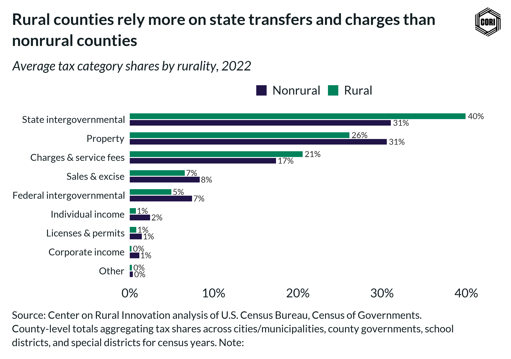

## Overview

Shows 2022 per-capita local government tax revenue broken out by tax type (property, sales/excise, individual income, corporate income) for rural vs. nonrural counties, enabling direct comparison of local revenue mix by geography.

## Key Findings

- Property taxes are the dominant local tax instrument in both rural and nonrural counties in 2022.
- Nonrural counties generate substantially more per-capita revenue from sales and income taxes than rural counties.
- Rural counties rely more heavily on property taxes as a share of total local tax revenue compared to nonrural counties.

## Reproducibility

Generated by `R/final_viz/G7_create_bar_chart_taxes_by_rurality.R` in the producing project.

::: {.callout-note}
## Dangling references

The following slugs are referenced by this project but do not yet have nodes in Dataverse. They are intentionally preserved as future content needs:

- `dataset/census-of-governments`
- `dataset/bls-cpi-deflators`
:::

