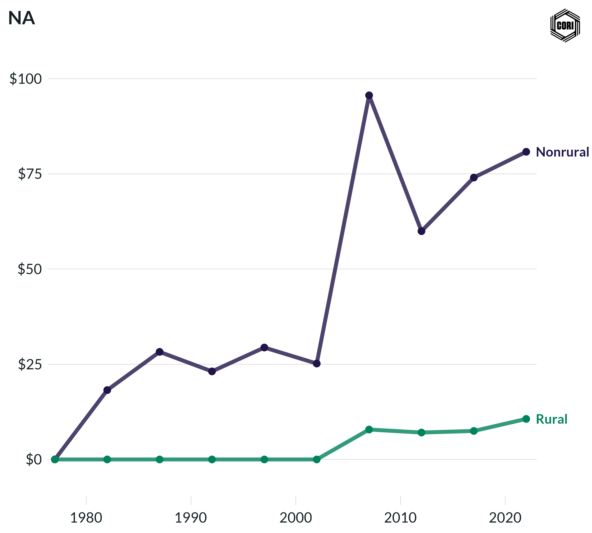

## Overview

Tracks inflation-adjusted (2022 dollars) local government corporate income tax revenue per capita for rural and nonrural counties at census years from 1977 to 2022.

## Key Findings

- Local corporate income taxes are rare and represent a negligible revenue source for most local governments.
- Any per-capita corporate tax revenue is concentrated in nonrural counties with large corporate tax bases.
- Rural counties report effectively zero local corporate income tax revenue throughout the study period.

## Reproducibility

Generated by `R/final_viz/K2_create_line_chart_corp_income_tax_pc.R` in the producing project.

::: {.callout-note}
## Dangling references

The following slugs are referenced by this project but do not yet have nodes in Dataverse. They are intentionally preserved as future content needs:

- `dataset/census-of-governments`
- `dataset/bls-cpi-deflators`
:::

