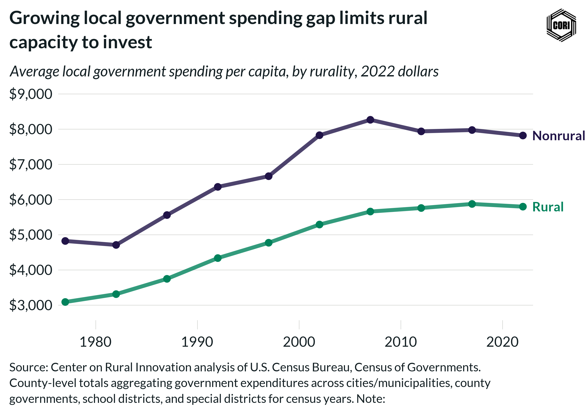

## Overview

Shows inflation-adjusted (2022 dollars) average local government direct expenditure per capita for rural and nonrural counties from 1977 to 2022, aggregated across all local government units at census years.

## Key Findings

- Nonrural counties spend substantially more per capita on local government services than rural counties.
- Direct expenditure grew steadily in real terms for both groups through 2007 before leveling off.
- The spending gap between rural and nonrural counties widened after 2002.

## Reproducibility

Generated by `R/final_viz/A1_create_line_chart_direct_expenditure.R` in the producing project.

::: {.callout-note}
## Dangling references

The following slugs are referenced by this project but do not yet have nodes in Dataverse. They are intentionally preserved as future content needs:

- `dataset/census-of-governments`
- `dataset/bls-cpi-deflators`
:::

