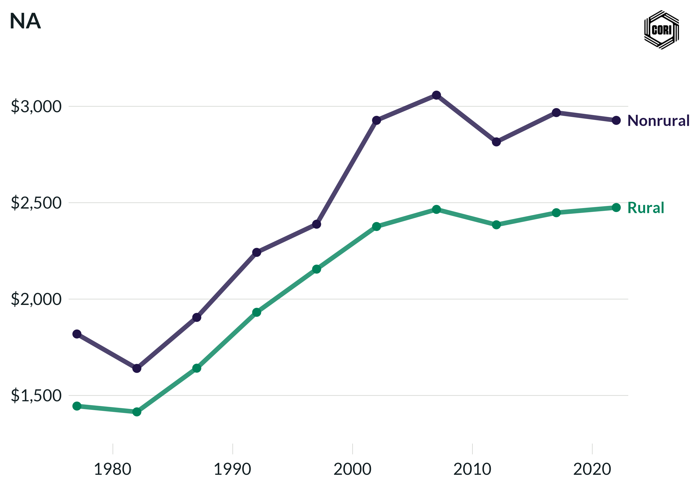

## Overview

Tracks inflation-adjusted (2022 dollars) local government education expenditure per capita for rural and nonrural counties at census years from 1977 to 2022.

## Key Findings

- Education is the largest single category of local government expenditure for both rural and nonrural counties.
- Real per-capita education spending grew steadily for both groups through 2007.
- Rural and nonrural counties show broadly similar per-capita education spending, reflecting state equalization aid formulas for school funding.

## Reproducibility

Generated by `R/final_viz/Q8_create_line_chart_education.R` in the producing project.

::: {.callout-note}
## Dangling references

The following slugs are referenced by this project but do not yet have nodes in Dataverse. They are intentionally preserved as future content needs:

- `dataset/census-of-governments`
- `dataset/bls-cpi-deflators`
:::

