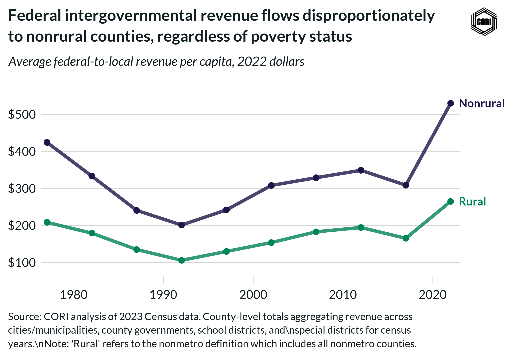

## Overview

Shows inflation-adjusted (2022 dollars) per-capita federal intergovernmental revenue flowing to local governments in rural and nonrural counties at census years from 1977 to 2022.

## Key Findings

- Federal transfers to local governments peaked in real terms in the early 1980s, declined through 2002, then partially recovered.
- Rural and nonrural counties received broadly similar levels of federal intergovernmental revenue per capita through the 1980s.
- By 2022 nonrural counties received more federal intergovernmental revenue per capita than rural counties.

## Reproducibility

Generated by `R/final_viz/D4_create_line_chart_federal_igr.R` in the producing project.

::: {.callout-note}
## Dangling references

The following slugs are referenced by this project but do not yet have nodes in Dataverse. They are intentionally preserved as future content needs:

- `dataset/census-of-governments`
- `dataset/bls-cpi-deflators`
:::

