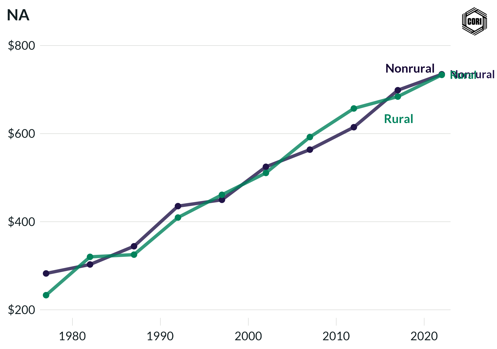

## Overview

Compares inflation-adjusted (2022 dollars) local government health and hospitals expenditure per capita for rural and nonrural counties at census years from 1977 to 2022.

## Key Findings

- Nonrural counties spend significantly more per capita on health and hospitals, driven by large public hospital systems in metro areas.
- Health and hospital spending grew substantially in real terms from 1992 onward for nonrural counties.
- Rural counties have lower per-capita public health/hospital investment, compounding existing access gaps.

## Reproducibility

Generated by `R/final_viz/S1_create_line_chart_health_hospitals.R` in the producing project.

::: {.callout-note}
## Dangling references

The following slugs are referenced by this project but do not yet have nodes in Dataverse. They are intentionally preserved as future content needs:

- `dataset/census-of-governments`
- `dataset/bls-cpi-deflators`
:::

