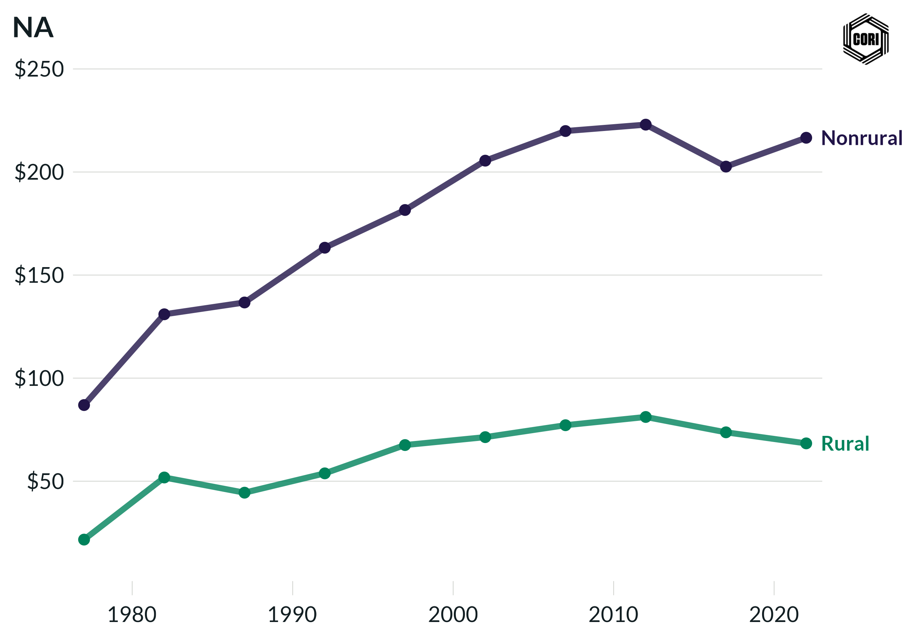

## Overview

Tracks inflation-adjusted (2022 dollars) local government housing and community development expenditure per capita for rural and nonrural counties at census years from 1977 to 2022.

## Key Findings

- Nonrural counties consistently spend more per capita on housing and community development, reflecting larger public housing authorities and community development programs in metro areas.
- Real per-capita housing expenditure peaked in the mid-1980s and declined through the 1990s for both groups.
- Rural per-capita housing investment remains low throughout the study period.

## Reproducibility

Generated by `R/final_viz/T2_create_line_chart_housing.R` in the producing project.

::: {.callout-note}
## Dangling references

The following slugs are referenced by this project but do not yet have nodes in Dataverse. They are intentionally preserved as future content needs:

- `dataset/census-of-governments`
- `dataset/bls-cpi-deflators`
:::

