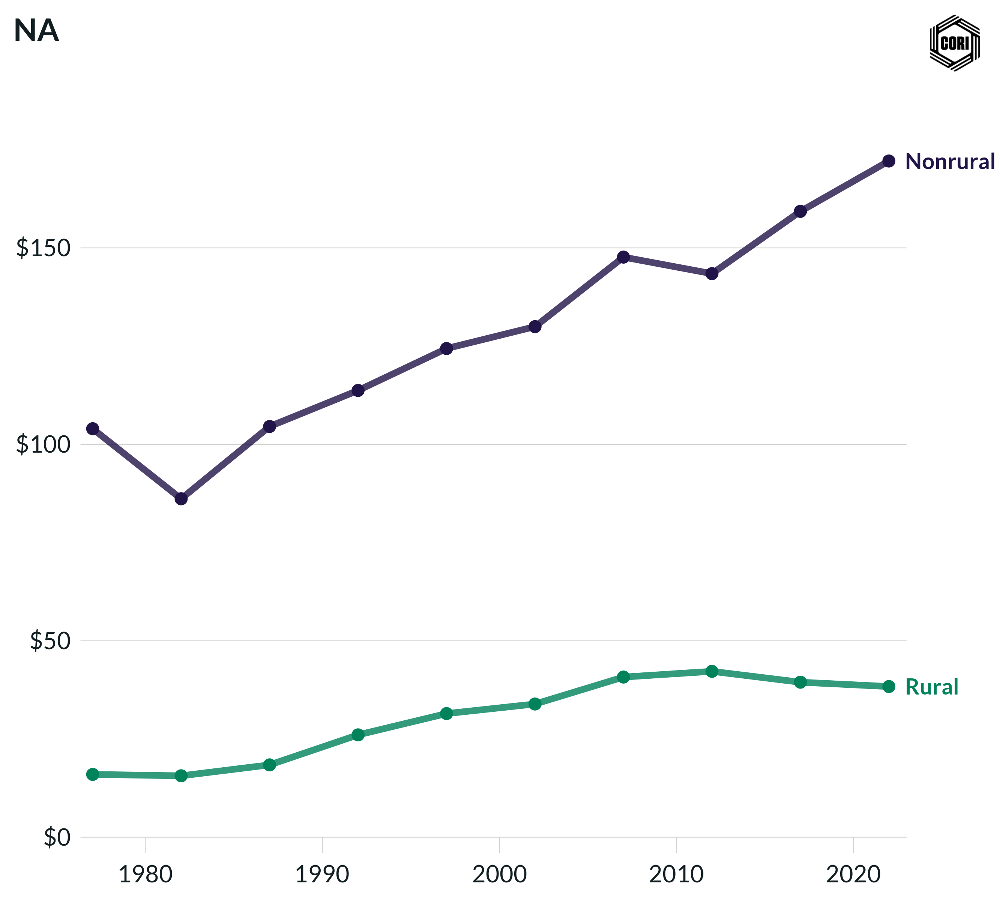

## Overview

Shows inflation-adjusted (2022 dollars) local government individual income tax revenue per capita for rural and nonrural counties at census years from 1977 to 2022.

## Key Findings

- Individual income taxes are a minor local revenue source, levied in only a subset of states that permit local income taxation.
- Nonrural counties generate more per-capita individual income tax revenue due to higher earnings and concentration in income-taxing jurisdictions.
- Rural per-capita individual income tax revenues are near zero across most of the study period.

## Reproducibility

Generated by `R/final_viz/J1_create_line_chart_indiv_income_tax_pc.R` in the producing project.

::: {.callout-note}
## Dangling references

The following slugs are referenced by this project but do not yet have nodes in Dataverse. They are intentionally preserved as future content needs:

- `dataset/census-of-governments`
- `dataset/bls-cpi-deflators`
:::

