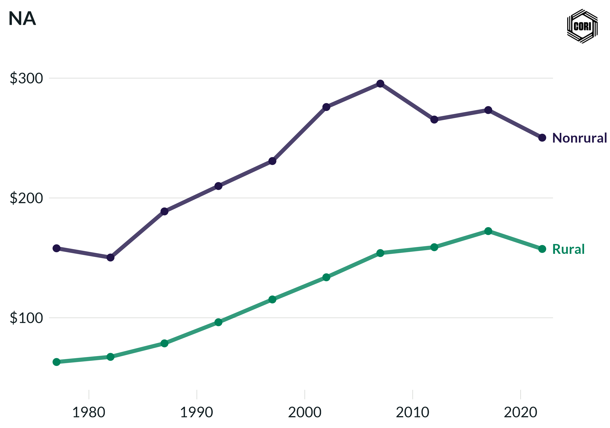

## Overview

Compares inflation-adjusted (2022 dollars) local government parks and recreation expenditure per capita for rural and nonrural counties at census years from 1977 to 2022.

## Key Findings

- Nonrural counties spend more per capita on parks and recreation, reflecting higher demand and capacity in metro areas.
- Parks and recreation spending grew in real terms from 1977 through 2007 for both groups.
- Rural per-capita parks and recreation spending is substantially lower than nonrural, reflecting both lower demand density and tighter local budgets.

## Reproducibility

Generated by `R/final_viz/U3_create_line_chart_parks_rec.R` in the producing project.

::: {.callout-note}
## Dangling references

The following slugs are referenced by this project but do not yet have nodes in Dataverse. They are intentionally preserved as future content needs:

- `dataset/census-of-governments`
- `dataset/bls-cpi-deflators`
:::

