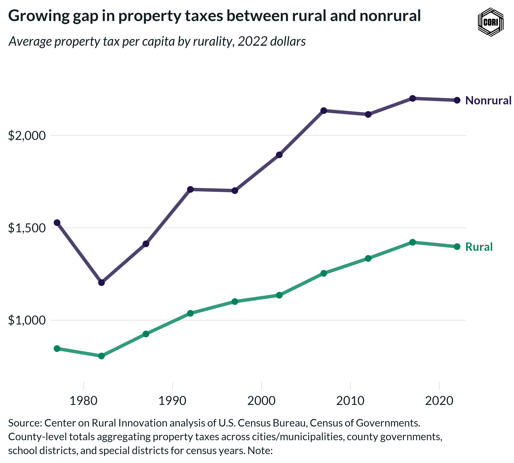

## Overview

Tracks inflation-adjusted (2022 dollars) local government property tax revenue per capita for rural and nonrural counties at census years from 1977 to 2022.

## Key Findings

- Property tax revenue grew in real terms for both rural and nonrural counties across the study period.
- Nonrural counties generate more property tax revenue per capita than rural counties in every census year.
- The rural–nonrural property tax gap widened after 2002.

## Reproducibility

Generated by `R/final_viz/H8_create_line_chart_property_tax_pc.R` in the producing project.

::: {.callout-note}
## Dangling references

The following slugs are referenced by this project but do not yet have nodes in Dataverse. They are intentionally preserved as future content needs:

- `dataset/census-of-governments`
- `dataset/bls-cpi-deflators`
:::

