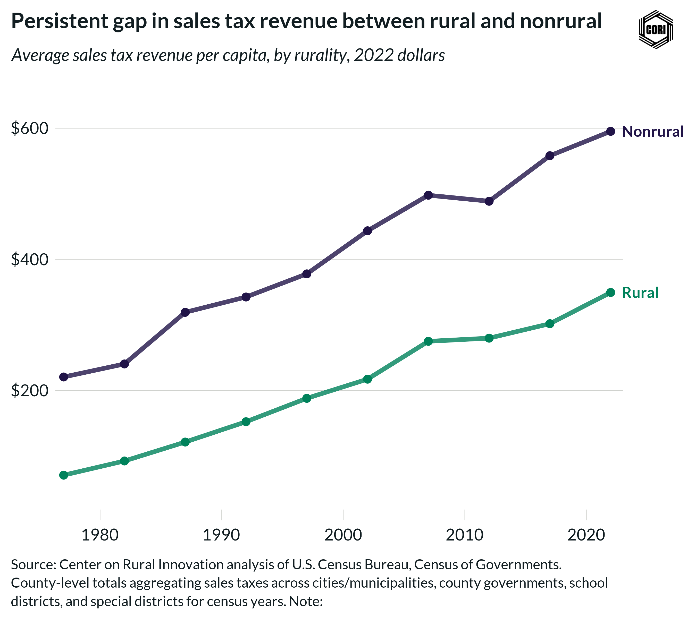

## Overview

Compares inflation-adjusted (2022 dollars) local government sales and excise tax revenue per capita for rural and nonrural counties at census years from 1977 to 2022.

## Key Findings

- Sales and excise tax revenue is substantially higher in nonrural counties, reflecting larger commercial tax bases.
- Both groups saw real growth in sales tax revenues from 1977 to 2007.
- Rural counties capture significantly less sales tax revenue per capita, reflecting lower retail activity and limited home-rule taxing authority in many rural states.

## Reproducibility

Generated by `R/final_viz/I9_create_line_chart_sales_tax_pc.R` in the producing project.

::: {.callout-note}
## Dangling references

The following slugs are referenced by this project but do not yet have nodes in Dataverse. They are intentionally preserved as future content needs:

- `dataset/census-of-governments`
- `dataset/bls-cpi-deflators`
:::

