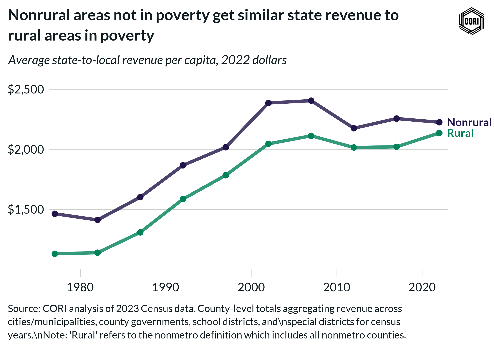

## Overview

Tracks inflation-adjusted (2022 dollars) per-capita state intergovernmental revenue to local governments in rural and nonrural counties at census years from 1977 to 2022.

## Key Findings

- State intergovernmental transfers are the largest intergovernmental revenue source for local governments in both geographies.
- Per-capita state transfers grew steadily through 2002 before leveling.
- Rural counties receive more state intergovernmental revenue per capita than nonrural counties across most of the period, reflecting state equalization formulas.

## Reproducibility

Generated by `R/final_viz/E5_create_line_chart_state_igr.R` in the producing project.

::: {.callout-note}
## Dangling references

The following slugs are referenced by this project but do not yet have nodes in Dataverse. They are intentionally preserved as future content needs:

- `dataset/census-of-governments`
- `dataset/bls-cpi-deflators`
:::

