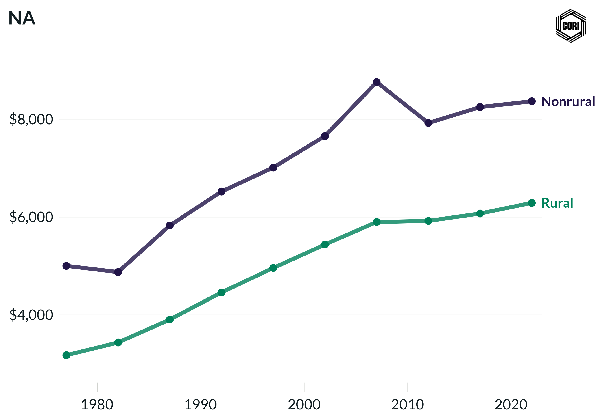

## Overview

Tracks inflation-adjusted total local government revenue per capita (2022 dollars) for rural and nonrural U.S. counties across census years from 1977 to 2022.

## Key Findings

- Nonrural counties consistently raise more total local government revenue per capita than rural counties.
- Total per-capita revenue grew in real terms for both groups through 2007.
- Rural counties show relatively flat real revenue per capita from 2002 to 2022.

## Reproducibility

Generated by `R/final_viz/B2_create_line_chart_total_revenue_pc.R` in the producing project.

::: {.callout-note}
## Dangling references

The following slugs are referenced by this project but do not yet have nodes in Dataverse. They are intentionally preserved as future content needs:

- `dataset/census-of-governments`
- `dataset/bls-cpi-deflators`
:::

