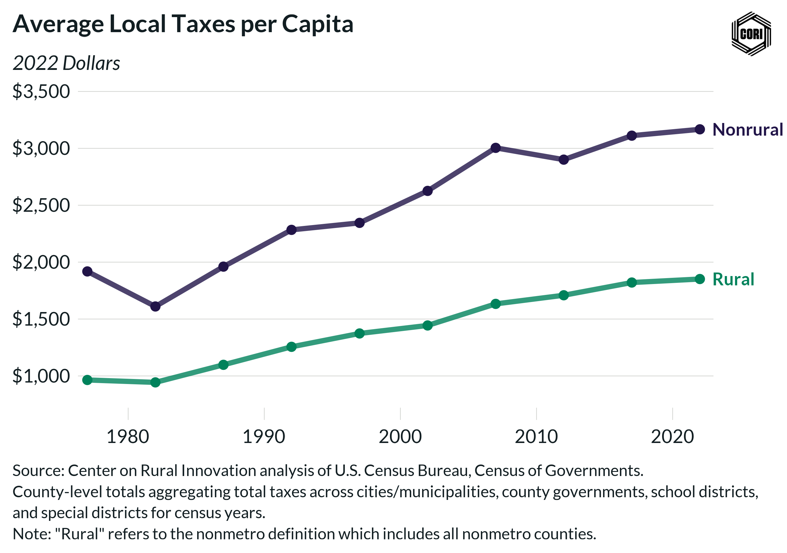

## Overview

Tracks inflation-adjusted (2022 dollars) average local government tax revenue per capita for rural and nonrural counties at census years from 1977 to 2022, aggregating taxes across municipalities, county governments, school districts, and special districts.

## Key Findings

- Nonrural counties generate higher per-capita tax revenue than rural counties across the full 1977–2022 period.
- Both groups saw real per-capita tax growth through 2002, with nonrural growth accelerating in the mid-1990s.
- The rural–nonrural tax revenue gap widened from 1992 onward.

## Reproducibility

Generated by `R/final_viz/9_create_line_chart_total_tax.R` in the producing project.

::: {.callout-note}
## Dangling references

The following slugs are referenced by this project but do not yet have nodes in Dataverse. They are intentionally preserved as future content needs:

- `dataset/census-of-governments`
- `dataset/bls-cpi-deflators`
:::

