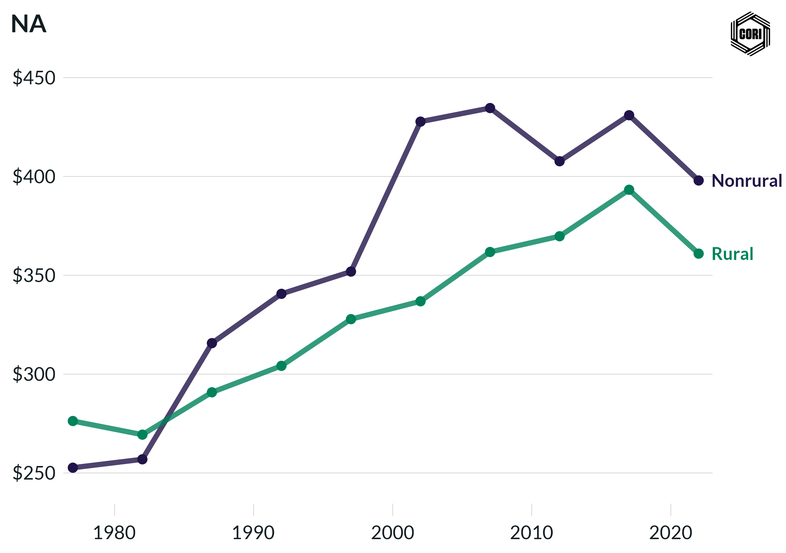

## Overview

Tracks inflation-adjusted (2022 dollars) local government transportation expenditure per capita for rural and nonrural counties at census years from 1977 to 2022.

## Key Findings

- Nonrural counties spend more per capita on transportation, driven largely by transit system expenditures in metro areas.
- Rural transportation spending is primarily highway and road maintenance with limited transit investment.
- The per-capita transportation spending gap between rural and nonrural counties widened after 1992.

## Reproducibility

Generated by `R/final_viz/N5_create_line_chart_transportation.R` in the producing project.

::: {.callout-note}
## Dangling references

The following slugs are referenced by this project but do not yet have nodes in Dataverse. They are intentionally preserved as future content needs:

- `dataset/census-of-governments`
- `dataset/bls-cpi-deflators`
:::

