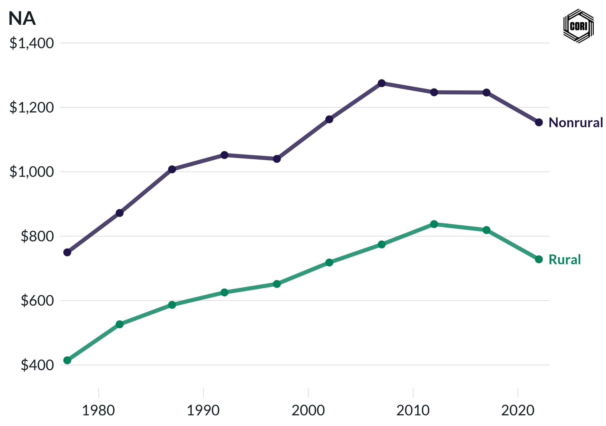

## Overview

Compares inflation-adjusted (2022 dollars) local government utilities expenditure (water, sewerage, electric, gas) per capita for rural and nonrural counties at census years from 1977 to 2022.

## Key Findings

- Local utilities spending is one of the few categories where rural and nonrural per-capita levels are relatively similar.
- Utilities expenditure grew in real terms for both groups through 2002.
- Rural counties show slightly higher per-capita utilities spending in some years, reflecting higher unit costs of infrastructure delivery in low-density areas.

## Reproducibility

Generated by `R/final_viz/O6_create_line_chart_utilities.R` in the producing project.

::: {.callout-note}
## Dangling references

The following slugs are referenced by this project but do not yet have nodes in Dataverse. They are intentionally preserved as future content needs:

- `dataset/census-of-governments`
- `dataset/bls-cpi-deflators`
:::

