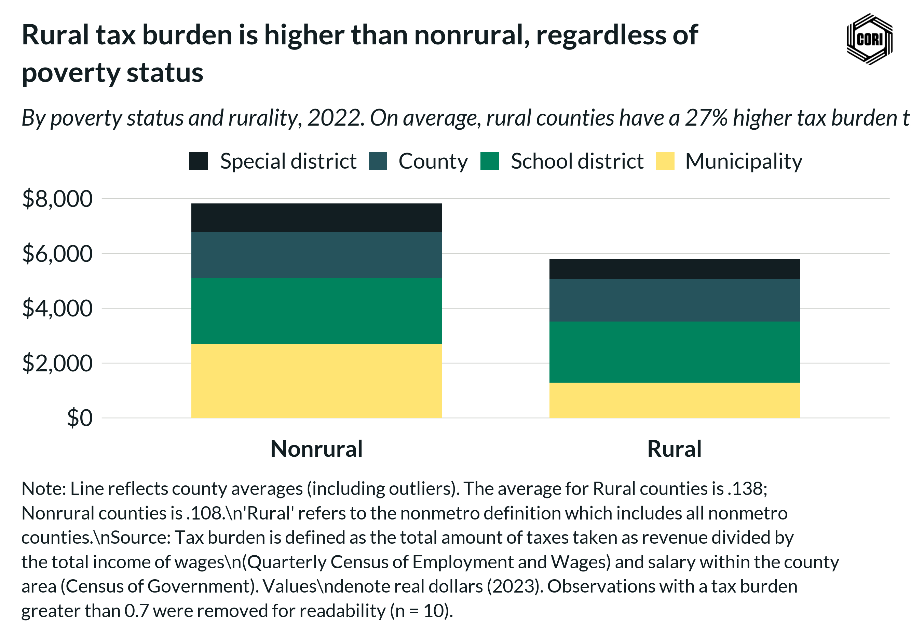

## Overview

Decomposes local government direct expenditure by funding category for rural and nonrural counties, illustrating structural differences in how local governments in each geography allocate spending.

## Key Findings

- Education is the dominant expenditure category for local governments in both rural and nonrural counties.
- Nonrural counties allocate a larger share to public welfare and health/hospitals than rural counties.
- Rural counties show a proportionally larger share of expenditure in utilities and infrastructure-related categories.

## Reproducibility

Generated by `R/final_viz/F6_create_stacked_bar_direct_expenditures.R` in the producing project.

::: {.callout-note}
## Dangling references

The following slugs are referenced by this project but do not yet have nodes in Dataverse. They are intentionally preserved as future content needs:

- `dataset/census-of-governments`
- `dataset/bls-cpi-deflators`
:::

