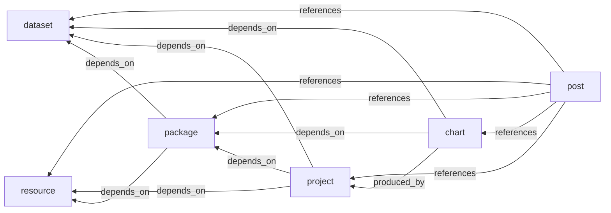

# cori.data.verse — Skill Authoring Reference

This file is the canonical reference for Claude Code skills that interact with cori.data.verse content. Skills should instruct Claude to read this file before performing discovery or generation work — it is the package's contract with skill consumers and ships with the package version.

## Architecture: Division of Labor

| Step | Performed by | Output |
|------|-------------|--------|
| Read README.md | Claude Code (Read tool) | Structured understanding |
| Scan project files | Claude Code (Glob/Grep) | List of R scripts, data, config |
| Parse params.yml | Claude Code (Read + reasoning) | Detected data sources |
| Parse renv.lock | Claude Code (Read + reasoning) | Detected packages |
| Map sources → slugs | Claude Code (reasoning) | Named list/character vector |
| Build description, title, tags | Claude Code (synthesis) | Strings/vectors |
| Validate slugs against local Dataverse | R function | Local valid/missing |
| Validate slugs against S3 Dataverse | R function | S3 valid/missing |
| Combine validation, partition into local/remote/dangling | R function | Three-way partition |
| Generate frontmatter YAML | R function | YAML string |
| Generate body content | R function | Quarto markdown string |
| Write index.qmd | R function | File on disk |

### Key insight

Claude Code is the "scanner/inferrer" and the R package is the "schema-validator/serializer." The R functions accept already-discovered values as arguments — they don't do filesystem scanning of the source project.

## Data Model

### Class Diagram

Resources are the catch-all input type: any input to a project or package that cannot be defined as a dataset or a package. Posts are the terminal consumer — all other types can be inputs to posts.

### Edge Types

Edges read as: source → relation → target. For `depends_on`, the arrow points from the consumer to the dependency (e.g., "package depends_on dataset"). For `references`, the arrow points from the post to the referenced item. For `produced_by`, the arrow points from chart to project.

| Source | Edge | Target | Derived from | Status |
|--------|------|--------|-------------|--------|
| package | `depends_on` | dataset | `package.usesDatasets[]` | Active |
| package | `depends_on` | resource | `package.usesResources[]` | Active |
| project | `depends_on` | dataset | `project.usesDatasets[]` | Active |
| project | `depends_on` | package | `project.usesPackages[]` | Active |
| project | `depends_on` | resource | `project.usesResources[]` | Active |
| chart | `depends_on` | dataset | `chart.usesDatasets[]` | Active |
| chart | `depends_on` | package | `chart.usesPackages[]` | Active |
| chart | `produced_by` | project | `chart.producedBy` | Active |
| post | `references` | any | `post.references[]` | Active |

All edges are active — no future/deferred edges. Every edge is derivable from frontmatter fields on the source node's `uses*`, `producedBy`, or `references` field. Post `references[]` entries use `{type}/{slug}` format (e.g., `"dataset/fcc-broadband"`) so the target type is parsed from the reference string.

## Key Skill Guidance

These five rules govern any skill that produces Dataverse content; they appear in skills as durable instructions to Claude.

1. Claude does the scanning, R does the schema work. Do not ask the R package to read README.md or params.yml.

2. Preserve dangling references. If Claude infers a dataset slug that doesn't yet exist in Dataverse, include it anyway — the graph treats this as a "future content need" signal.

3. Slug format: kebab-case only (`census-bds`, not `census_bds` or `Census BDS`).

4. Body content reflects actual project state. If README claims outputs that don't exist on disk, the body should say so (e.g., "Status: in development") rather than reproduce aspirational claims.

5. Frontmatter is the contract. The `usesDatasets/usesPackages/usesResources` arrays are what `build_graph()` reads — they must be correct kebab-case slugs.
